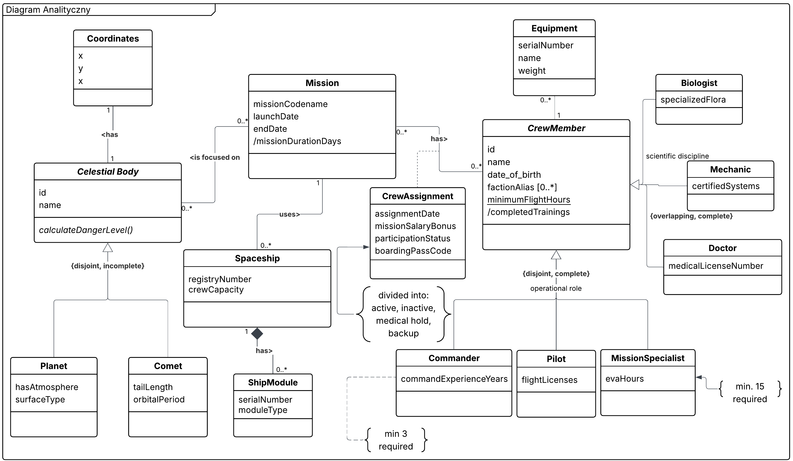
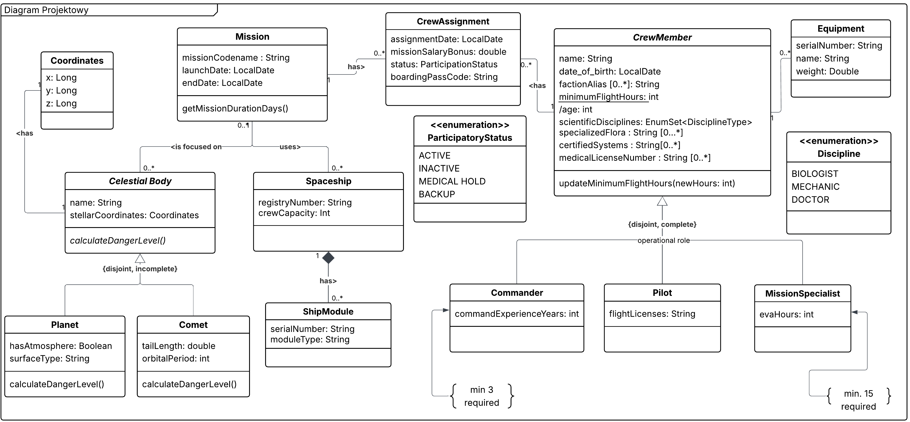
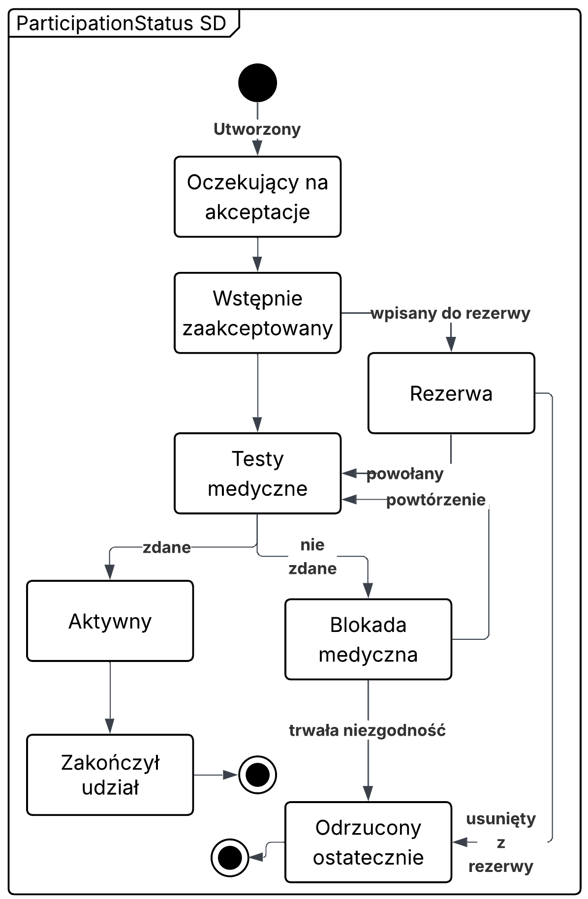

# Mission Control Center

A Java desktop application for assigning astronauts to space missions, built with Swing, Hibernate ORM and a local H2 database. This coursework project demonstrates domain modelling, bidirectional associations, database constraints, transactions and asynchronous desktop UI operations.

## Features

- Browse missions and the astronaut registry.
- Add and remove persistent crew assignments.
- Reject duplicates, overlapping schedules and assignments beyond ship capacity.
- Generate boarding-pass codes and populate an empty database with demonstration data.

## Requirements and commands

JDK 17 or newer and Maven 3.8.5 or newer. A graphical desktop is required to run the application. The first Maven build needs access to Maven Central for dependencies and plugins.

Run from this directory (MAS/FINAL_PROJEKT), not the parent MAS aggregator:

    mvn test
    mvn package

The POM is standalone. To launch in IntelliJ IDEA, open this directory’s pom.xml as a project, reload Maven, choose JDK 17 or 21, then run org.example.Main from src/main/java. Use the FINAL_PROJEKT module classpath and set the working directory to this project directory. The packaged JAR does not bundle dependencies and is not directly executable.

The application creates space_db.mv.db in its working directory and inserts sample data only when the mission table is empty. Existing database files are not required. Tests use isolated H2 databases in memory and never modify the application's database file.

## Example workflow

1. Select APOLLO-20 and an astronaut, then click **Dodaj**.
2. Try assigning the same astronaut to APOLLO-21: its schedule overlaps, so the operation is rejected.
3. Assign the astronaut to MARS-ONE: its schedule is separate.
4. Select a crew assignment and click **Usuń**, then confirm removal.

## Business rules

- Mission date intervals include both endpoints: a shared boundary day is a conflict.
- ACTIVE and BACKUP reserve seats and block overlapping missions for an astronaut. MEDICAL_HOLD and INACTIVE do neither.
- An astronaut has at most one assignment per mission, regardless of status.
- Capacity is checked per mission; scheduling a ship across missions is outside the current scope.
- Status changes are revalidated. Mission dates and the assigned ship cannot change while any assignments remain; remove assignments first.
- Ship capacity cannot fall below the reserved crew size of any associated mission.
- Commanders require at least three years of command experience; mission specialists require at least 15 EVA hours.
- A module belongs to one ship. Adding it twice is idempotent; sharing it with another ship is rejected.
- Equipment transfers update both astronauts' collections. Removing an association does not delete the equipment record.

## Architecture

    Swing MainWindow
      -> CrewAssignmentService
        -> Hibernate Session / DatabaseManager
          -> H2

Entities enforce domain rules. CrewAssignmentService owns transactions, explicit persistence and rollback. It locks the ship and then the crew member to serialize capacity and schedule checks. DatabaseManager manages the SessionFactory and read queries.

Database work runs in SwingWorker; interface updates remain on the Swing event dispatch thread. Assignment/member data is loaded before read sessions close. A shutdown hook closes the SessionFactory.

The registryNumber Java field retains the original registryNumer database column for compatibility. Hibernate schema management still uses update; versioned migrations are not implemented.

## UML diagrams

### Analytical class diagram

### Design class diagram

### Activity diagram

### State diagram

## Tests

Thirteen JUnit 5 tests cover interval boundaries, status changes, duplicates, capacity, constructors, module ownership, equipment transfers, persistent reload/deletion, rollback after a database failure and concurrent assignment attempts.

See [VERIFICATION.md](VERIFICATION.md) for environment-specific verification results.
